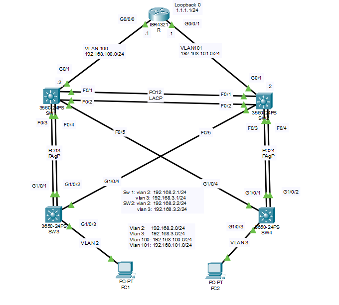
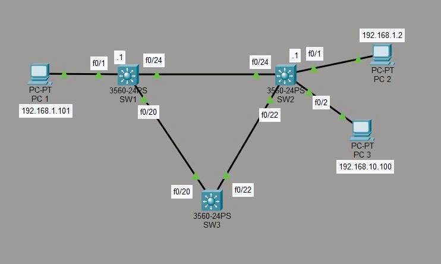

# CCNA-
# Lab 01: VLAN, VTP, EtherChannel, DHCP, EIGRP, Routing, STP, HSRP

## 🎯 Mục tiêu
- Cấu hình các vấn đề đã đề cập 
- Thiết lập địa chỉ IP
- Kiểm tra kết nối với ping

## 📝 Hướng dẫn cấu hình
Xem file `Configuration command lab 1.txt`
## Topology

## 📁 Files
- `Lab 1.pkt` - File Packet Tracer
- `Configuration command lab 1.txt` - Các lệnh cấu hình
- `Topology_lab_1.png` - Sơ đồ mạng
- `Show running-config lab 1.7z` - File cấu hình backup

# Lab 02: Port Security, SPAN
## 🎯 Mục tiêu
- Cấu hình các vấn đề đã đề cập 
- Thiết lập địa chỉ IP
- Kiểm tra kết nối với ping và hoạt động

## 📝 Hướng dẫn cấu hình
Xem file `Configuration command lab 2.txt`
## Topology
 

## 📁 Files
- `Lab 2.pkt` - File Packet Tracer
- `Configuration command lab 2.txt` - Các lệnh cấu hình
- `Topology_lab_2.png` - Sơ đồ mạng
- `Show running-config lab 2.7z` - File cấu hình backup
